# Dokumentation Messeplaner (IAS)

## 1. Einleitung

In der folgenden Dokumentation wird ein Konzept für eine Messeverwaltungssoftware von Robert Hartings und Alexander Niersmann beschrieben.

Bei der Messeverwaltungssoftware handelt es sich um eine Webanwendung und soll über einen Browser (Mobile & Desktop) erreicht werden.
Für beide Device Typen soll die gute Nutzbarkeit sichergestellt werden.

Das Konzept umfasst die Beschreibung der Nutzergruppen Veranstalter, Aussteller und Besucher und deren Anforderungen an die Messeverwaltungssoftware.
Ebenso werden die Interaktionsmöglichkeiten mithilfe von UML-StateCharts und der visuelle Aufbau der Webseite durch Website Wireframes dargestellt.

## 2. Allgemeiner Aufbau der Software

### 2.1 Wireframe Grundlayout

Die Anwendung ist in zwei Nuterzinterfacebereich eingeteilt, welche dynmaisch geladen / entleert werden.
Erstens gitb es den Navigationsbereich, in welchen die Navigationselemente geladen werden.
Zweitens wird in den Contentbereich der Inhalt geladen, dies kann unter anderem Informationen über Messe oder Halle sein.

Desweitern gibt es ein Suchfeld in dem nur Austeller gesucht werden können.

**Desktop Version:**


**Mobile Version:**

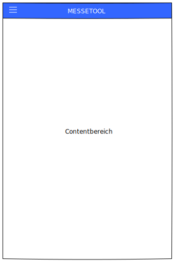
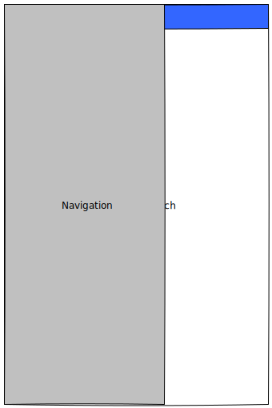

## 3. Verschiedene Nutzungszenarien

### 3.1 Veranstalter

#### 3.1.1 Allgemeine Beschreibung

Die Nutzergruppe Veranstalter soll die Aufteilung und Belegung von Messehallen planen und verwalten
sowie neue Hallen und Messen anlegen können. Dazu zählt auch das Annehmen oder Ablehnen von Buchungsanfragen
sowie das Verändern von Verkehrsflächen oder Halleninfrastruktur.

#### 3.1.2 Beschreibung Persona

Der Veranstalter stellt pro Messe eine oder mehrere Hallen zur Verfügung,
damit Aussteller sich dort auf Ständen präsentieren  können und
Besuchern sich über diese Aussteller informieren können.
Weiterhin kümmert sich der Veranstalter um die Verteilung der Verkehrsflächen und der Halleninfrastruktur.
Das heißt erstellt sicher, dass die genügend Wege, Ein- und Ausgänge und Notausgänge eingeplant sind und
Toiletten und Restaurants vorhanden und auf den Messeplänen eingetragen sind.

Ein Veranstalter hat die Möglichkeit mehr als eine Messe abzuhalten.

#### 3.1.3 Interaktionsdesign

##### 3.1.3.1 Übersicht Interaktion

Dem Messeveranstalter stehen folgenden Interaktionen zur Verfügung:

- Login / Logout
- Übersicht über Buchungen
- Messenauswahl
    - Übersicht über die Messe
    - Hallenauswahl
        - Änderungen Hallenlayout
    - Übersicht über Buchungen dieser Messe
    - Halle anlegen
- Messe anlegen

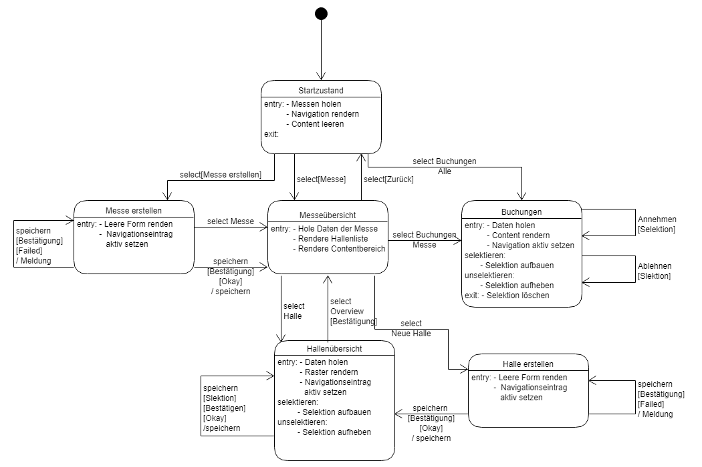

Die Navigationsübersicht sieht auf Desktop wie folgt aus:

##### 3.1.3.2 Login / Logout

Die Loginseite ist über eine unterseite erreichbar, damit Besucher von Messen durch dieses Element nicht gestört werden
und nicht die Annahme treffen, dass ein Login notwendig für sie ist. Der Login ist für Veranstalter und Austeller derselbe.
Bei falschen Logininformationen wird der Nutzer hingewiesen, dass mit den gegeben Logininformationen ein Login nicht möglich ist.
Ein neuer Login, kann nur durch einen Menschen der Gruppe Messeveranstalter angelegt werden.

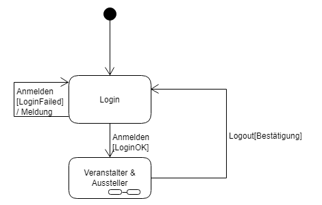

**Desktop:**


**Mobile:**


##### 3.1.3.3 Buchungen

In der Buchungsübersicht werden alle Buchungen aufgeführt.
Die Buchung kann durch einen Mitarbeiter angenommen oder abgelehnt werden.
Die Buchungen erhalten die Informationen über Aussteller, Messe, Halle und Stand.

**Desktop:**


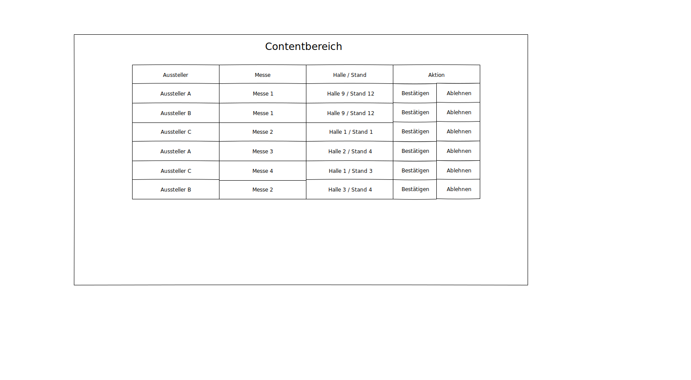

**Mobile:**

##### 3.1.3.4 Messenauswahl

Der Benutzer kann sich aus der Liste eine Messe auswählen, welche er betrachten möchte.
Nach Auswahl der Messe, wird die Navigation, durch die messensepzifische Navigation ersetzt.
Das heißt, dass die Liste durch eine Liste von Hallen plus Einträge für "Messeübersicht", "Zurück zur Messenübersicht",
"Buchungsübersicht" getauscht wird. Für den Contentbereich siehe **3.1.3.4.1**

###### 3.1.3.4.1 Übersicht Messe

In der Messeübersicht erhält der Contentbereich Informationen über die Messe, wie z.B. Anfahrtswege und Öffnungszeiten.
Hier können neue Hallen angelegt werden und Informationen zur Messe geändert werden. Änderungen müssen gespeichert werden.

In der Navigationsliste wird der Eintrag als aktiv makiert.

**Desktop:**

**Mobile:**

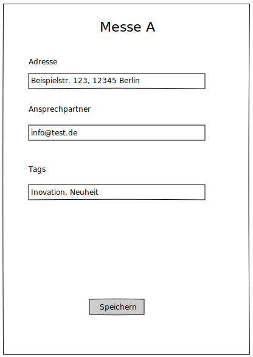

###### 3.1.3.4.2 Übersicht Buchungen der Messe

In dieser Übersicht werden nur die Buchungen angezeigt, welche die ausgewählte Messe betreffen.
Die Tabelle ist unterscheidet sich zur allgemeinen Buchungsliste nur durch das Fehlen der Messespalte.
_**Siehe 3.1.3.3**_

###### 3.1.3.4.3 Übersicht Hallen
In der Hallenübersicht kann der Veranstalter die Flächen zu Wegen, Toiletten, Restaurants und Freiflächen ändern.
Hier sieht der Veranstalter auch welche Flächen bereits reserviert sind.

**Desktop:**

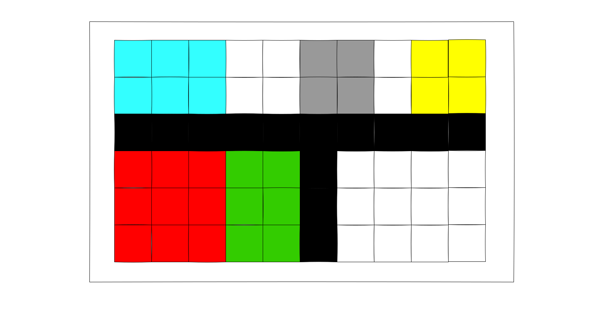

**Mobile:**

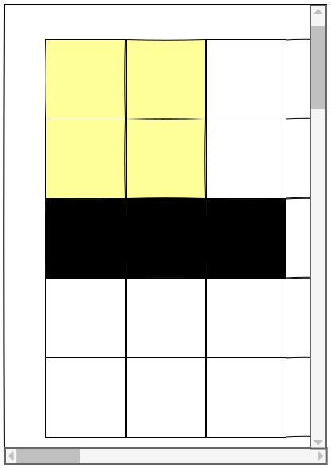

###### 3.1.3.4.3 Halle hinzufügen
Der Veranstaler kann neue Hallen hinzufügen. Hierbei muss er die Hallen Breite und Länge angeben.

**Desktop:**

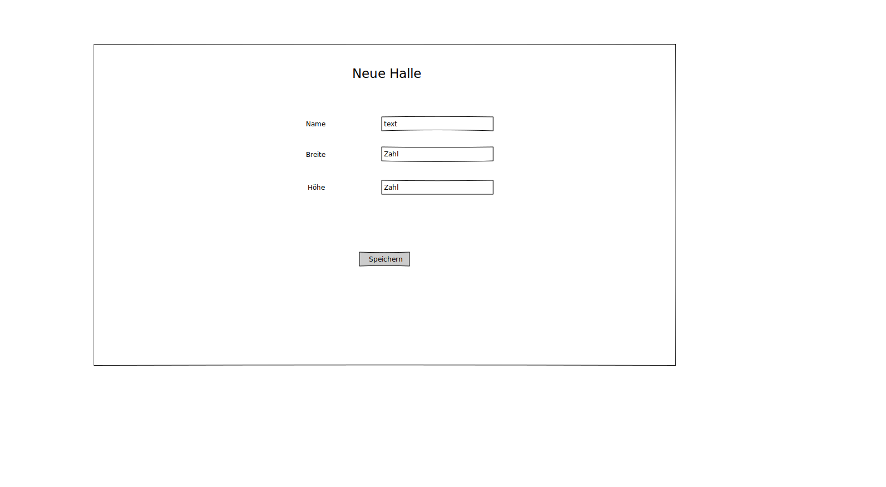

**Mobile:**

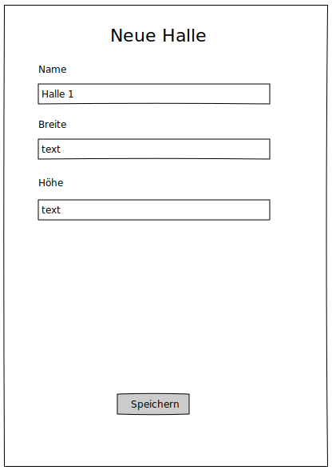

#### 3.1.3.5 Anlegen von Messen
Die Veranstalter Gruppe kann neue Messen anlegen,
hierzu können Basisinformaitonen angegen werden, wie Adresse und Ansprechpartner. Diese Informationen sind öffentlich einsehbar.

**Desktop:**

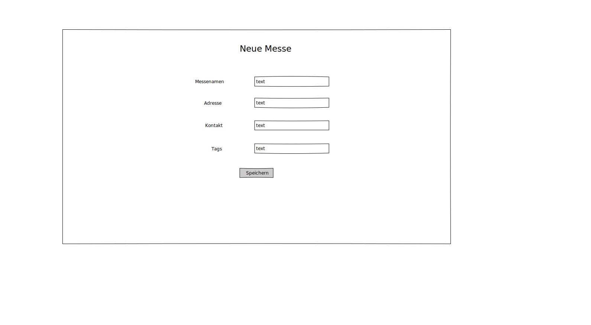

**Mobile:**

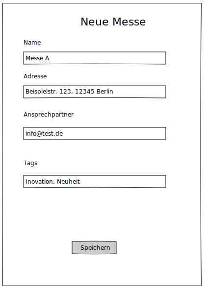

### 3.2 Aussteller

#### 3.2.1 Allgemeine Beschreibung

Die Nutzergruppe Aussteller hat die Möglichekeit Messestände anzumieten in dem sie eine Buchung beantragt.
Eine Stonierung ist bis zum Begin der Messe möglich, sofern die Buchung durch den Veranstalter genemigt wurden ist.

Ein Aussteller kann mehrer Buchungen pro Messe durchführen.

#### 3.2.2 Beschreibung Persona

Der Aussteller tritt auf der Messe auf um sich Besuchern zu präsentieren um so auf seine Produkte / Dienstleistugen aufmerksam zu machen.
Um diese zu tun, muss der Aussteller die Gegebenheiten der Halle sowie den Platz seines Standes wissen
und er muss die Möglichkeit haben, Informationen zu sich, seinem Stand und seiner Präsentation abzulegen.

#### 3.2.3 Interaktionsdesign

##### 3.2.3.1 Übersicht Interaktion

Dem Austeller stehen folgenden Interaktionen zur Verfügung:

- Login / Logout
- Übersicht über Buchungen
- Messenauswahl
    - Übersicht über die Messe
    - Hallenauswahl
        - Buchungen
    - Übersicht über Buchungen dieser Messe
    - Zurück

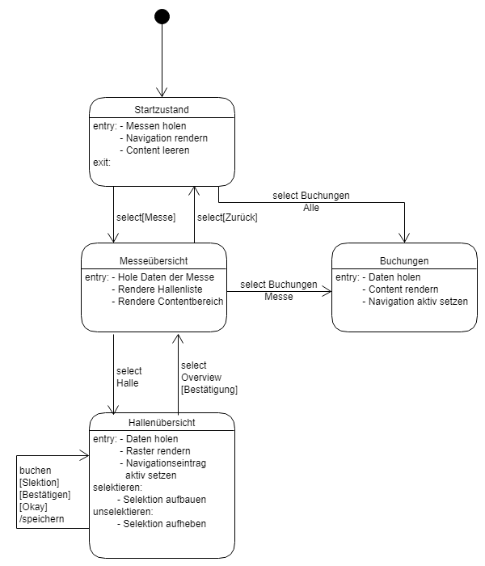

Die Navigation sieht wie folgt aus:

**Desktop**

**Mobile:**

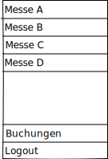

##### 3.2.3.2 Login / Logout

Der Aussteller bekommt vom Messeveranstalter seinen Login und kann sich mit diesem wie der Messeveranstalter anmelden.
**Siehe 3.1.3.2**

##### 3.2.3.3 Übersicht Buchungen

In dieser Übersicht sieht ein Veranstalter für welche Messen er sich in welchen Hallen einen oder mehrere Stände gemietet hat
und ob diese Buchung von dem Messeveranstalter angenommen oder abgelehnt wurden ist. Diese Übersicht ist als Tabelle aufebaut.

**Desktop:**

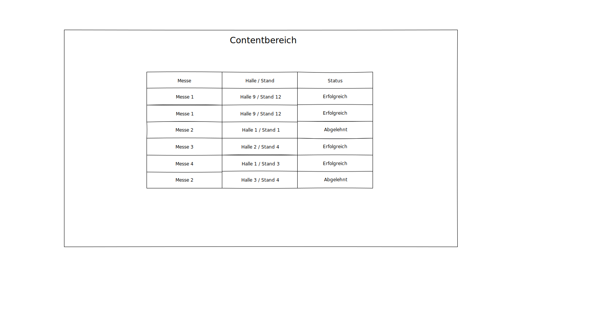

**Mobile:**

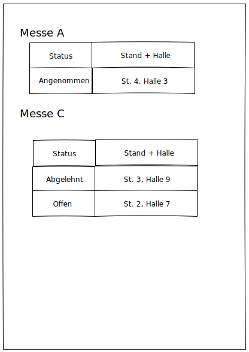

##### 3.2.3.4 Messenauswahl

Der Benutzer kann sich aus der Liste eine Messe auswählen, welche er betrachten möchte.
Nach Auswahl der Messe, wird die Navigation, durch die messensepzifische Navigation ersetzt.
Das heißt, dass die Liste durch eine Liste von Hallen plus Einträge für "Messeübersicht", "Zurück zur Messenübersicht",
"Buchungsübersicht" getauscht wird. Für den Contentbereich siehe **3.2.3.4.1**

##### 3.2.3.4.1 Übersicht Messe

In der Messeübersicht erhält der Contentbereich Informationen über die Messe, wie z.B. Anfahrtswege und Öffnungszeiten.

In der Navigationsliste wird der Eintrag als aktiv makiert.

**Desktop:**

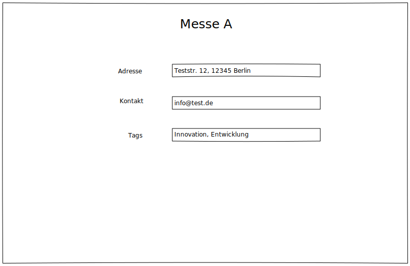

**Mobile:**

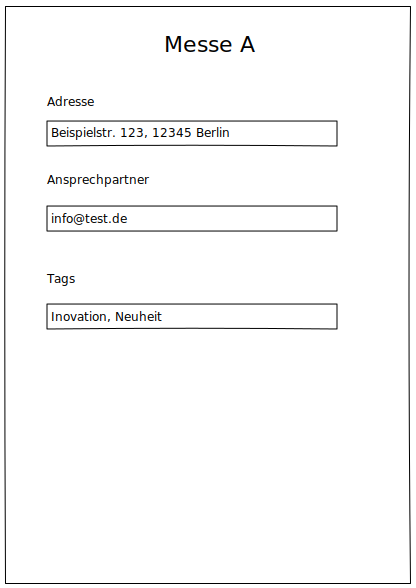

##### 3.2.3.4.2 Hallenauswahl

Der Benutzer kann sich aus der Liste der Hallen eine Halle auswählen und erhält dann eine Hallenübersicht.
Diese Hallenübersicht beinhaltet ein Raster der Halle inklusive der Basisinfrastruktur (Restuarants, Toiletten, Flucht- und Rettungswege, Ein- und Ausgänge).
sowie der Aussteller, welche der Messebetreibe zugelassen hat.
Falls der Benutzer eine Fläche buchen möchte kann dieser seine gewünschte Fläche makieren und eine Buchung aufgebene.

Der Contenbereich sieht wie folgt aus:

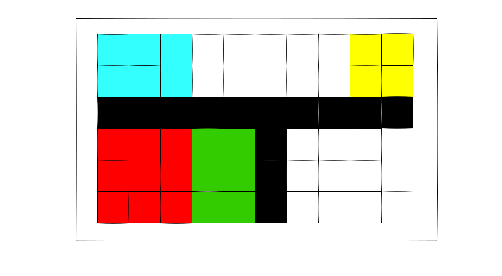

**Mobile Version:**

In der Navigationsliste wird die aktuelle Auswahl hervorgehoben.

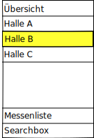

Der Contentbereich sieht wie folgt aus:

##### 3.2.3.4.3 Übersicht Buchungen der Messe

In dieser Übersicht werden nur die Buchungen angezeigt, welche die ausgewählte Messe betreffen.
Die Tabelle ist die gleiche wie bei der "allgemeinen" Buchungsübersicht, bis auf das fehlen der Messespalte.
_**Siehe 3.2.3.3**_

##### 3.2.3.4.4 Auswahl Zurück

Der Benuzter kehrt zur Messenübersicht zurück und kann sich dort erneut eine Messe auswählen welche er betrachten möchte.

### 3.3 Besucher

#### 3.3.1 Allgemeine Beschreibung

Die Nutzergruppe Besucher hat die Möglichkeit sich die verschiedenen Messe und ihre Hallen(-pläne) anzuschauen.
Auch kann die Nutzergruppe Besucher Informationen über Halleninfrastruktur und Aussteller sowie deren gegeben Informationen abrufen.

#### 3.3.2 Beschreibung Persona

Der Besucher nutzt die Messeplanungssoftware um Informationen über die Messe, die Hallenaufteilung sowie einzelne Aussteller zu erhalten.
Er benutzt die Software auch um herauszufinden, ob ein bestimmter Aussteller vertreten ist und wo dieser sich befindet.

#### 3.3.3 Interaktionsdesign

##### 3.3.3.1 Übersicht Interaktion

Dem Besucher stehen folgende Interaktionen zur Auswahl:

- Auswahl der Messe in der Navigation
    - Übersicht der Messe
        - Informationen über die Messe (Öffnungszeiten, Standort)
        - Auflistung der Aussteller inkl. Hallennummer
    - Hallenauswahl
        - Übersicht der Hallenstruktur mit gefärben Feldern
    - Zurück zur Messenauswahl
- Suchen von Ausstellern

##### 3.3.3.2 Auswahl Messe

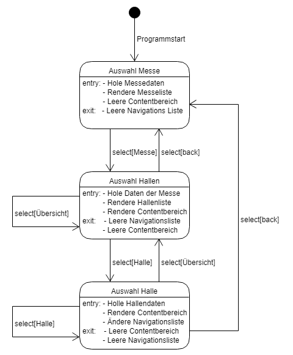

Eine Messe kann aus der Liste von Messen ausgewählt werden. Diese Liste beffindet sich im Navigationsbereich.

**Desktop:**

**Navigation:**

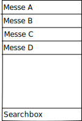

###### 3.3.3.2.1 Auswahl einer Messe

Der Besucher kann sich aus der Liste eine Messe auswählen, welche er betrachten möchte.
Nach Auswahl der Messe, wird die Navigation, durch die Messensepzifische Navigation ersetzt.
Das heißt, dass die Liste der Messen durch eine Liste von Hallen plus einer Messeübersicht und
einem "Zurück zur Messenübersicht" getauscht wird. Der Contentbereich erhält dann Informationen über die Messe,
wie z.B. Anfahrtswege und Öffnungszeiten.

**Desktop Version:**

In der Navigationsliste wird die Übersicht als aktiv makiert:

Der Content bereich wird wie folgt dargestellt:

**Mobile Version:**

In der Navigationsliste wird die Übersicht als aktiv makiert:

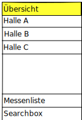

Der Content bereich wird wie folgt dargestellt:

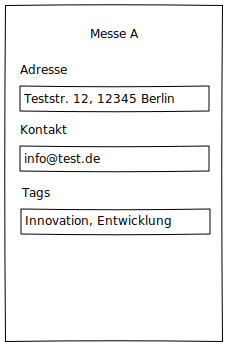

###### 3.3.3.2.2 Auswahl einer Halle

Der Besucher kann sich aus der Liste der Hallen eine Halle auswählen und erhält dann eine Hallenübersicht.
Diese Hallenübersicht beinhaltet ein Raster der Halle inklusive der Basisinfrastruktur
(Restuarants, Toiletten, Flucht- und Rettungswege, Ein- und Ausgänge) sowie der Aussteller,
welche der Messebetreibe zugelassen hat.

**Desktop Version:**

In der Navigationsliste wird die aktuell ausgewählte Halle farblich hervorgehoben.

Der Contenbereich sieht wie folgt aus.
Hierbei werden die flächen farblich von einander unterschieden,
sodass Aussteller, Toiletten, Wege und Restaurants andere farben erhalten.

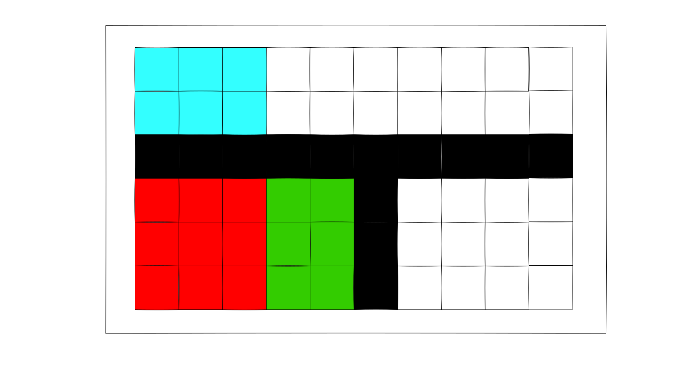

**Mobile Version:**

In der Navigationsliste wird die aktuelle Auswahl hervorgehoben.

Der Contentbereich sieht wie folgt aus:

Im Vergelich zum Contentberich auf dem Desktop wird in der mobilen Ansicht keine Raster dargestellt.
Statt desen wird hier eine Tabelle mit Standnummern und Inforamtionen zum Stand (Aussteller, Toiletten und Restaurants)
dargestellt. Flucht- und Rettungswege sowie Ein- und Ausgänge werden hierbei nicht brücksichtigt. Dies ist nötig, damit
eine gute Nutzbarkeit auf mobilen Endgeräten gewährleistet werden kann.

###### 3.3.3.2.3 Auswahl Übersicht

Der Besucher kann sich die Übersicht über die Messe wieder anzeigen lassen.
Hier entsteht die selbe Benutzeroberfläche wie in **3.3.3.2.1**

###### 3.3.3.2.4 Auswahl Zurück

Der Besucher kehrt zurück zur Messenübersicht und kann sich dort erneut eine Messe auswählen welche er betrachten möchte.

##### 3.3.3.3 Austeller Suchen

In der Suche können Aussteller gefunden werden, welche auf Messen vertretten sind.
Sollte eine bestimmte Messe vom Benutzer ausgewählt sein, wird die Suche nur innerhalb dieser Messe durchgeführt.

Das Ergebnis der Suche wird als Tabelle dargestellt.
In einer Spalte stehen die Austellernamen und in der anderen die Stand- und Hallenbezeichnung.
Sollte bei der Suche keine Messe ausgewählt sein, wird die Information über die Messe ebenfalls in einer Tabellenspalte hinterlegt.

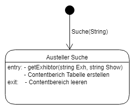

**Desktop Version:**

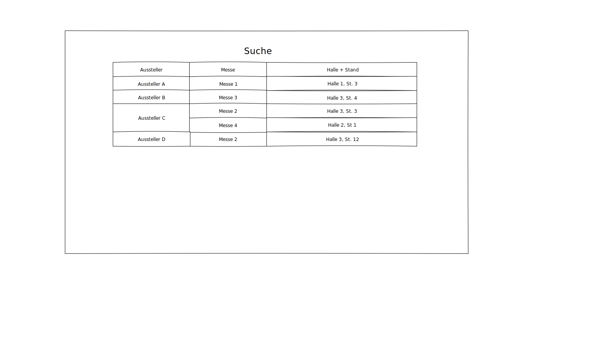

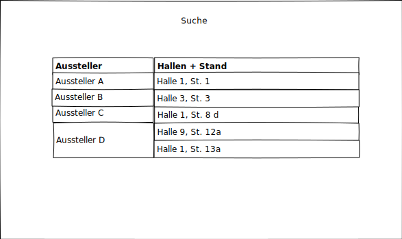

**Mobile Version:**

